# Intro (19.02.2020)


## Quiz

http://86.119.37.112:9090
Matrikel Nr & key
Plan: 11 points per week
Passing threshold: 60%  

Key: **543**

---

---

# Functions

```js
function fun2()    { return 1; }
function fun2(arg) { return arg; } //Hier wird fun2 überschrieben

document.writeln( fun2() !== 1  );
document.writeln( fun2() === undefined ); // <-- fun2() ist nun undefined
document.writeln( fun2(42) === 42 );
```

**Eine Funktion kann nur einmal erstellt werden. Es gibt nur eine referenz auf diese. => kein overloading möglich!**

```js
function noReturn()    { 1; } //undefined => no return statement
const noReturn2 = () => { 1; }; //undefined => da {} kein ausdruck sind und nach => kommt ein ausdruck
```

> In einem Block "{}" sind eine reihe von Anweisungen, getrennt mit ;

### Definitionsmöglichkeiten

```js
function fun1()	{ return 1; }
const fun2 = () => 1; //can't overwrite fun2 => runtime error
```

Javascript ist compilerlos => variable überschreiben oder runtime error

(**zuweisung) wird als ausdruck gewertet!**
js forced ausdruck

**Yoda Conditional** RightValue === LeftValue instead of LV == RV

```js
 function doit(waszutunist) {
 return function bla(arg) { return waszutunist(arg) };
 }
document.writeln( doit(fun1)(10) === 1 ); //Curried fun1()()
document.writeln( doit(fun2)(10) === 10 );

//equivalent zu
 const doit2 = (callme => (arg => callme(arg)) ;
 document.writeln( doit2(fun1)(10) === 1 );

```

**Function scope ist der einzig verlässliche scope in JS!**

```js
const plus = x => y => x+y; //can be called with plus(x)(y) curried
```

---

# Lambda

## Console.log

```js
//statt
console.log("idhgihfdg" + 1 + "jogofjig");
//mehrere Parameter, da console.log mehrere parameter nehmen kann
console.log("ggfgfdg", 1, "gfgdgf");
```

Weitere console methods: `warn(), error(), debug(), info()...`
console.table():
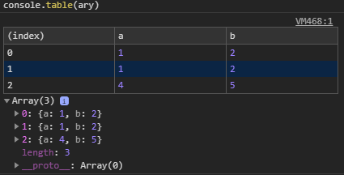

### Timer

```js
console.timer("timerName"): //Start timer
console.timeLog("timerName"); //Log Time
console.timeEnd("timerName"); //End Timer
```

### Objekte untersuchen

```js
const x = {a: 1, b:2};
console.dir(x);
//returned "view" of object
```

### Document Object

Haupt Objekt von JS im Browser
`this == window, this.document == document, window == this.window^^`

Hat viele Properties, window zb. zeigt auf sich selber.

---

# Canvas

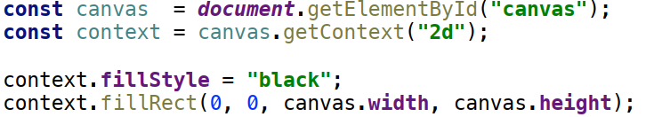

### Key Events

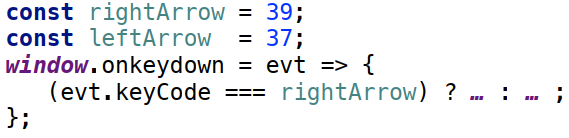

### Game Loop

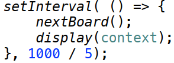


# Basic Array Methods

```yml
--> unshift() <-- shift() [ARRAY] --> pop() <-- push()
```

---

# Scopes

| global   | windows (in Browser)                                         |
| -------- | ------------------------------------------------------------ |
| function | no matter where defined, vars are local to the enclosing function (lambda) |

# Variables Declaration

```js
x = ... //mutable, global scope --> DON'T USE
var x = ... //mutable, "hoisted" scope --> DON'T USE
let x = ... //mutbale, local scope
const x = ... //immutable*, local scope
```

**Hoisted Scope** var defined at beginning of function scope:

```js
//possible with hoisted scope:
function dumb() {
	return x;
	var x = "Hello";
}
```

## IIFE (Immediately invoked function expression)

```js
function foo() {...}; foo() 
(function foo() {...}) () //ruft direkt den ausdruck (function) auf
(function() {...}) () //anonyme function 
(() => {...}) () //lambda 
```

---

# Lambdas

## Lambda Calculus

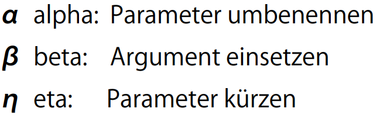

### Alpha Translation

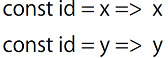

### Beta Reduction

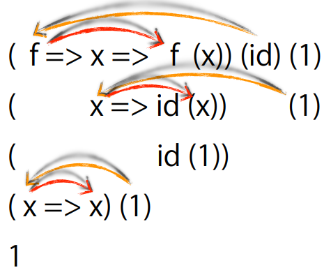

Einsetzen der Argumente in die definition

### Eta Reduction

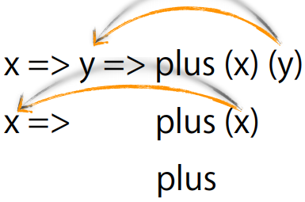

Wenn letztes Parameter auch letztes Parameter link im lambda ist, darf man "kürzen"

```js
const id = x => x; //Identity
const fst = x => y => x; //vergisst das 2. argument
const snd = fst(id); //ignoriert das erste argument

document.writeln(id(id) === id); //true
document.writeln(fst(id)("blub") === id); //true
document.writeln(fst(id)(null) === id); //true
document.writeln(snd(null)(id) === id); //vergisst das erste argument //true


const one = fst(1); //da das 2. argument egal ist

document.writeln(one() === 1); //true
```

# Undefined / Null

JS hat 2 grundlegende "Null" Datentypen: Null & Undefined. JS verwendet hauptsächlich undefined.

Null: Könnte einen Wert haben, habe noch keinen

Undefined: Keine Ahnung von was du redest

# Lambda Boolean Logic

```js
const id = x => x; //id
const M = f => f(f);
const konst = x => y => x; //first
const snd = x => y => y; //second

const T = konst; //Eta reduced from const T = x => y => konst(x)(y);
const F = snd;

//von and = x => y => x(y(T)(F))(y(F)(F));
const and = first => second => first(second)(first);
//von or = x => y => x(y(T)(T))(y(T)(F));
//von or = first => first(first); => Mockingbird
const or = M;

const flip = f => x => y => f(y)(x);

const Pair = x => y => f => f(x)(y);

const firstname = konst;
const lastname = snd

const Left = x => f => g => f(x);
const Right = x => f => g => g(x);
const either = e => f => g => e(f)(g);

```

###  Y-Combinator

`Y=M(M)`

Immutable Datenstrukturen nur via function scope => da function scope das einzige sichere scope

---

# Array deconstruction

```js
let array = [1, 2, 3]
let [a, b] = [1, 2, 3]
//Links deconstructor, rechts constructor
//deconstructor legt kein neues array an!
// => a = 1, b = 2

//nimmt nur erstes element von array
const head = ([first]) => first;
//head(["hello", "world"])
//=> "hello"

//=> der rest des eigentlichen arrays wird einfach nicht verwendet!!

//functional array swap function
const swap = ([a, b]) => [b, a];
```

# "Partial" Application (map, filter, reduce)


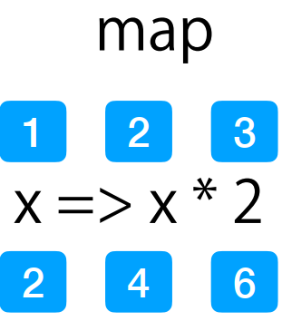

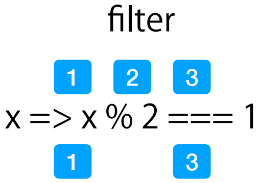

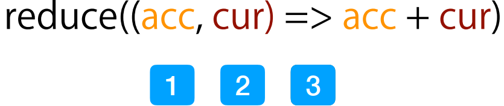

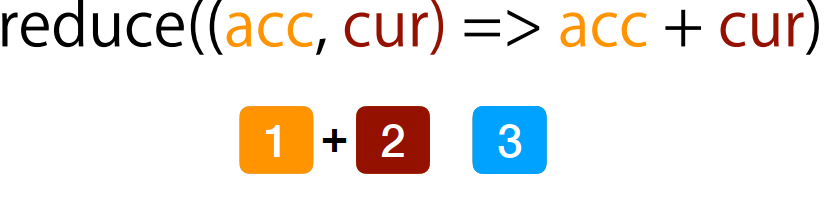

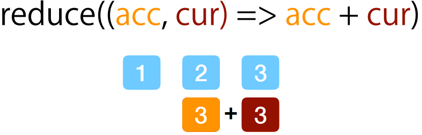

...

gibt neues Array zurück.

```js
//map
const times = a => b => a * b;
const twoTimes = times(2);
[1, 2, 3].map(x => times(2)(x));
[1, 2, 3].map(times(2));
[1, 2, 3].map(twoTimes);

//filter
const odd = x => x % 2 === 1;
[1, 2, 3].filter(x => x % 2 === 1);
[1, 2, 3].filter(x => odd(x));
[1, 2, 3].filter(odd);

//reduce
const plus = (accu, cur) => accu + cur;
[1, 2, 3].reduce((accu, cur) => accu + cur);
[1, 2, 3].reduce(plus);
// variant with initial accu value as 2nd argument
// then cur starts at first element
[1, 2, 3].reduce(plus, 0);

```

---

# Scripting 

## Strings in JS

**Es gibt keine Characters in JS!**

```js
const a = "Let's Go"; //Single Quotes in Double Quotes
const b = 'Citation: "Blub"'; //Double Quotes in Single Quotes

//Regex Object between /regex/
const c = String( /abc/ ); 

//Literale Declaration of Template Strings => über mehrere Zeilen und mit JS Code in ${}
const d = `Ich sagte: ${a} und ${b}
blub

blaaaab
`; 
```

either ist komplett unnötig => genau id
Da ETA-Reduction

```js
const either = e => f => g => e (f) (g);
... = e => f => e (f);
... = e => e;
... = id;
```


## Paradigmen in JS

1. Functional
2. OOP
3. Scripting


## What is Scripting

Evaluating Text

**Sources: **file, URL, DB, Input

Text can be modified, amended, etc...

---

#  Objects

## What are Objects?

Data Structures (location for mutable state, abstraction and polymorphism)

Methods for access and management

## Approaches

### Open, dynamic 

JS Objects

```js
const good = {
    firstname : "Good",
    lastname : "Boy",
    getName : function() {
    	return this.firstname + " " + this.lastname
    }
};
// no safety but super dynamic
// unobvious how to share structure
// beware of "this"! See Adam Breindl last week.
```

### Closed Explicit 

closure scope, no "this"

```js
function Person(first, last) {
    let firstname = first; // optional
    let lastname = last;
        return {
        getName: function() {
        	return firstname + " " + lastname }
        }
    }
}
// best safety, easy to share structure, but no class
```

### Mixed, classified

depends on "new"

```js
const Person = ( () => { // lexical scope
    function Person(first, last) { // ctor, binding
        this.firstname = first;
        this.lastname = last;
}
    Person.prototype.getName = function() {
        return this.firstname + " " + this.lastname;
    };
    return Person;
}) (); // IIFE
// new Person("Good", "Boy") instanceof Person
```

Is the "default" construction

Still dynamic, all instances can be changed at once by changing prototype

**new kreiirt neues leeres object und gibt es dem konstruktor mit**

## Prototype

- Is itself an object 
- Can be checked e.g. by **instanceof**

- Classifies objects similiar to a "type"
- Manages shared properties

## New

Creates **new** runtime-scope

Calls the **construcor**-Function (**cannot be lambda (because this)**)

Sets the prototype

### This

> Referenziert immer den Receiver!

---

# Classes

#### JS Goodie: Create Array from 0 to N

```js
Array.from("Hallo"); takes string and makes "char" array
//["H", "a", "l", "l", "o"]

Array.from( {length: 10} );
//[undefined, ... , undefined]

Array.from( {length: 10} ).map( (element, index) => index);
//Creates array from 0 to N
//[0, 1, 2, 3, 4, 5, 6, 7, 8, 9]


```

## class and extends

```js
class Person {
    constructor(first, last){
        this.firstname = first;
        this.lastname = last;
    }
    getName(){
        return this.firstname + " " + this.lastname;
    }
}

class Student extends Person {
    constructor(first, last, grade){
        super(first, last); //DO NOT FORGET
        this.grade = grade;
    }
}

const s = new Student("Top", "Student", 5.5);
```

extends is syntactic sugar for creating a **prototype** chain (since ES6)

## Functions are Objects

They have the **prototype** property!

It references an object that

- has a name (~ "Type")
- has a **constructor** (Type Function)
- has itself a **prototype**  

## Objects are Functions

Not in the sense of JavaScript functions.

But in the sense of computer science,
they are functions (in the general sense)
from their keys to their values.  

## Prototype


Alle Students bekommen *die selbe Instanz* von Protoype!

Prototypes can be set at runtime, essentially changing the "type":

`Object.setPrototypeOf(obj, proto);`

And since prototype is an object, it can be modified and extended

## Dynamic Dispatch

> Properties (and so also functions) are first looked for in the object and then in its prototype.
> And since prototypes are themselves objects, their prototype are used as well - making a chain until Object.prototype.  

=> this looks like inheritance...


